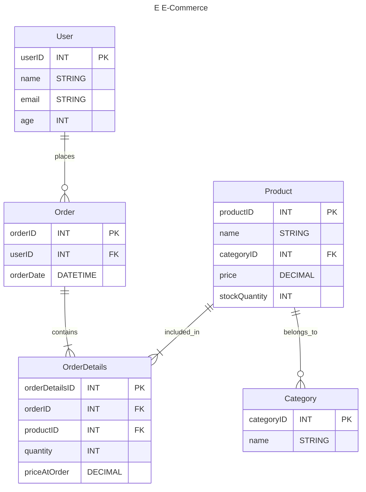

# E-CommerceSQL

```mermaid
---
title: E E-Commerce
---
erDiagram
    User {
        userID INT PK
        name STRING
        email STRING
        age INT
    }

    Order {
        orderID INT PK
        userID INT FK
        orderDate DATETIME
    }

    OrderDetails {
        orderDetailsID INT PK
        orderID INT FK
        productID INT FK
        quantity INT
        priceAtOrder DECIMAL
    }

    Product {
        productID INT PK
        name STRING
        categoryID INT FK
        price DECIMAL
        stockQuantity INT
    }

    Category {
        categoryID INT PK
        name STRING
    }

    User ||--o{ Order : places
    Order ||--|{ OrderDetails : contains
    Product ||--|{ OrderDetails : included_in
    Product ||--o{ Category : belongs_to

```
